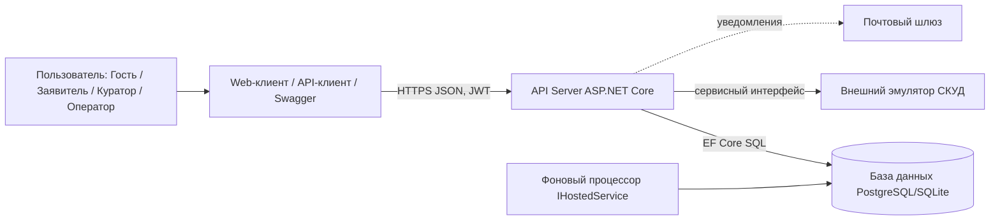
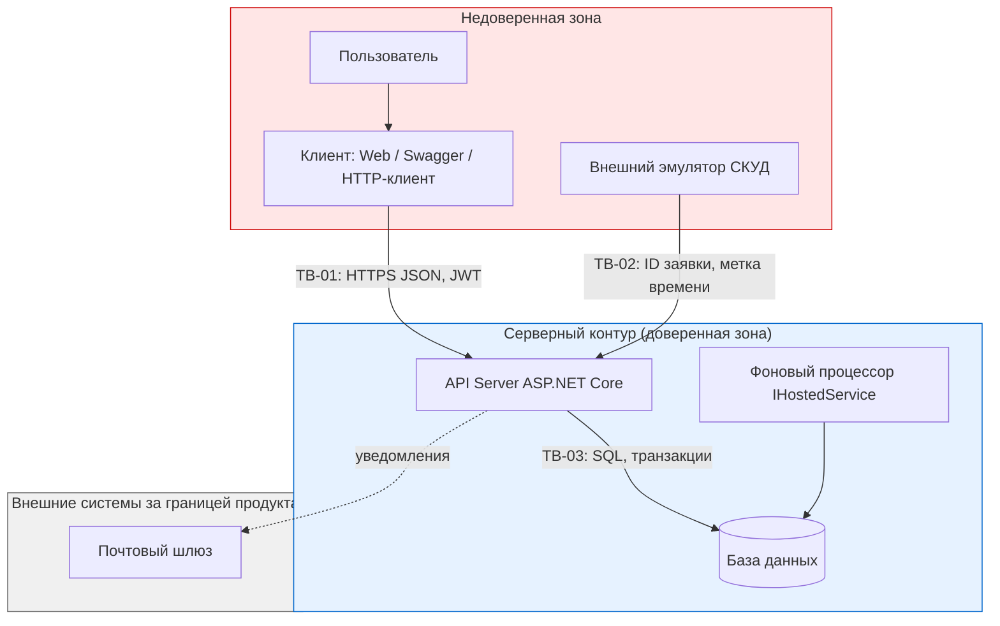
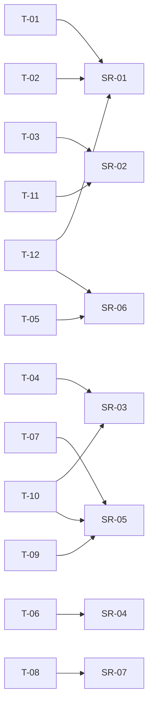
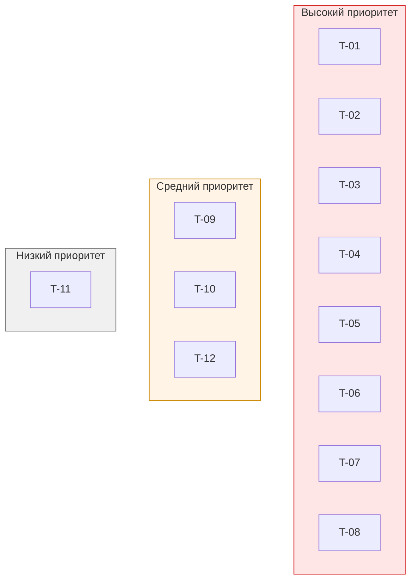

# Модель угроз

## Модель продукта

AccessFlow - сервис подачи, согласования и контроля временных допусков студентов и сотрудников в помещения кампуса. Продукт заменяет бумажные служебные записки прозрачным цифровым маршрутом согласования: заявитель создаёт заявку, куратор помещения принимает решение, оператор бюро пропусков активирует или аннулирует допуск, а система фиксирует неизменяемый аудиторский след.

**Что уже существует:**

- Серверное Web API (ASP.NET Core) для управления жизненным циклом заявок на допуск.
- Разграничение прав доступа на основе ролей (JWT claims) и проверка зоны ответственности за конкретное помещение при согласовании.
- Бизнес-логика контроля ограничений: проверка корректности временного окна (начало раньше окончания, длительность до 4 часов) и контроль лимита вместимости при согласовании.
- Ведение журнала аудита решений (`AuditLogEntry`): запись событий создания и согласования заявки.
- Реляционное хранилище SQLite через Entity Framework Core: таблицы помещений, заявок и аудита.
- Интеграция с внешним эмулятором СКУД через эндпоинт `POST /api/access/validate` с серверной проверкой статуса и времени.

**Что пока планируется:**

- Фоновый процессор (IHostedService) для перевода истёкших заявок в `Expired`.
- Отправка email-уведомлений о смене статуса заявки.
- Загрузка вложений к заявке.
- Составные заявки на группу из нескольких человек.
- Переход на PostgreSQL при необходимости масштабирования.
- Явные транзакционные блокировки на уровне БД для контроля лимита вместимости (сейчас проверка есть, но без `SELECT ... FOR UPDATE`).
- Полная проверка владения ресурсом на чтении чужой заявки (`GET /api/requests/{id}`).
- Проверка аннулирования/отзыва в точке `validate` (статусы `Revoked`/`Cancelled`).

**Существенные допущения:**

- Подлинность пользователя уже установлена; сервер получает из доверенного контекста идентификатор текущего пользователя и его роль (JWT Bearer).
- Клиентская сторона (Swagger UI / Minimal Web Client / интеграционный HTTP-клиент) считается недоверенной.
- Внешний эмулятор СКУД взаимодействует с API Server по сервисному интерфейсу; подлинность самого эмулятора в рамках модели принимается как установленная, но передаваемые им данные (ID заявки, метка времени) остаются недоверенным вводом.
- Почтовый шлюз - внешняя система, вынесенная за границу продукта.

**Архитектурный вид:**



Точки входа API (условно):

```text
POST   /api/requests                  - создание заявки
GET    /api/requests/my               - свои заявки
GET    /api/requests/{id}             - детали заявки
PATCH  /api/requests/{id}             - редактирование до отправки
POST   /api/requests/{id}/cancel      - отзыв заявки
POST   /api/requests/{id}/approve     - согласование куратором
POST   /api/requests/{id}/reject      - отклонение куратором
POST   /api/requests/{id}/revoke      - аннулирование оператором
POST   /api/access/validate           - валидация прохода от СКУД
GET    /api/audit                     - журнал аудита
PATCH  /api/rooms/{id}/policy         - изменение правил помещения
```

## Границы доверия



| Граница | Что пересекает | Почему требуется проверка |
| --- | --- | --- |
| **TB-01: Клиент → API Server** | HTTP-запросы: JSON-тела заявок, параметры маршрутов (`roomId`, `requestId`), заголовки авторизации, команды согласования и отзыва | Клиент полностью недоверенный: скрытые поля, отсутствующие кнопки и клиентская валидация не гарантируют, что запрос сформирован легитимно. Сервер обязан самостоятельно проверять полномочия, принадлежность ресурса, допустимость перехода статуса и бизнес-ограничения. |
| **TB-02: Внешний эмулятор СКУД → API Server** | ID заявки / электронного пропуска, временная метка попытки входа, запрос `Allow`/`Deny` | Эмулятор - внешняя система, работающая вне контура продукта. Даже при установленной подлинности канала сервер не должен доверять переданным ID и метке времени: он обязан сам проверить статус заявки и текущее время по своим часам. |
| **TB-03: API Server → База данных** | SQL-запросы, транзакции изменения статусов, записи аудита | Внутренняя граница, но значимая: целостность и атомарность транзакций критичны для неизменяемости аудита и контроля лимита вместимости. Компрометация учётных данных БД или инъекция ломают все защитные свойства сразу. |

## Значимые объекты и свойства

По разделу 5 паспорта проекта:

| Объект | Что защищаем | Последствия нарушения |
| --- | --- | --- |
| **Заявка `AccessRequest`** | Статус, владелец, интервал, помещение, обоснование | Несанкционированное изменение статуса → незаконное проникновение; удаление → срыв занятий/экспериментов |
| **Правила и квоты `RoomPolicy`** | Лимит вместимости, часы работы, назначенный куратор | Завышение лимита → нарушение пожарных норм; сброс графика → блокировка подачи заявок |
| **Журнал аудита `AuditLogEntry`** | Неизменяемость, полнота, атрибуция | Скрытие злоупотреблений, невозможность служебного расследования |
| **Полномочия и роли** | Соответствие роли, привязка куратора к помещению, запрет самосогласования | Подмена роли или зоны ответственности → доступ в чужие помещения в обход контроля |
| **Журнал проходов `AccessLog`** | Достоверность фактов входа | Ложные или скрытые проходы → невозможность расследования инцидентов физической безопасности |

## Угрозы

| ID | Сценарий угрозы | Что нарушается | Граница / точка входа | Связанные SR | Приоритет и обоснование |
| --- | --- | --- | --- | --- | --- |
| **T-01** | Заявитель подставляет в `POST /api/requests/{id}/approve` идентификатор чужой заявки, находящейся в помещении, за которое он не отвечает, и пытается согласовать её от своего имени | SR-01: полномочная изоляция и запрет согласования вне зоны ответственности | TB-01, `POST /api/requests/{id}/approve` | SR-01 | **Высокий.** Прямая эскалация полномочий: компрометация одной учётной записи открывает физический доступ в критические помещения. Реалистичность высокая - достаточно знать/угадать ID заявки. |
| **T-02** | Куратор помещения `R` подаёт заявку в помещение `R` от своего имени, а затем отправляет на неё `approve` от себя же, обходя независимый контроль | SR-01: запрет самосогласования и конфликт интересов | TB-01, `POST /api/requests/{id}/approve` | SR-01 | **Высокий.** Нарушает separation of duties - ключевой принцип продукта. Куратор имеет легитимный доступ к эндпоинту, поэтому защита должна быть на уровне проверки `ApplicantId != CurrentUserId`. |
| **T-03** | Заявитель после получения `Approved` отправляет `PATCH /api/requests/{id}` и меняет интервал визита на ночное время или добавляет посторонних участников, сохраняя визу согласовавшего | SR-02: неизменяемость параметров санкционированного доступа | TB-01, `PATCH /api/requests/{id}` | SR-02 | **Высокий.** Атака подмены параметров после согласования превращает дневной учебный доступ в бесконтрольный ночной. Реалистична при отсутствии серверной проверки статуса при редактировании. |
| **T-04** | Эмулятор СКУД (или злоумышленник, выдающий себя за него) отправляет `POST /api/access/validate` с ID заявки в статусе `Approved`, но с временной меткой внутри интервала, тогда как реальное текущее время вне окна; либо подставляет ID заявки, срок которой ещё не наступил | SR-03: временная гранулярность физического доступа | TB-02, `POST /api/access/validate` | SR-03 | **Высокий.** Одобренный разовый пропуск превращается в «вечный ключ». Сервер обязан проверять время по своим часам, а не доверять метке из запроса. |
| **T-05** | Заявитель `A` отправляет `GET /api/requests/{id_B}` с чужим идентификатором и получает тело заявки пользователя `B` (цель визита, интервал, помещение) | SR-06: конфиденциальность и ограничение доступа по владению | TB-01, `GET /api/requests/{id}` | SR-06 | **Высокий.** IDOR при предсказуемых ID позволяет собрать базу о графике перемещений и темах закрытых исследований. При использовании UUIDv4 риск снижается, но проверка владения всё равно обязательна. |
| **T-06** | Оператор бюро пропусков или администратор отправляет `DELETE /api/audit/{id}` или `PUT /api/audit/{id}`, пытаясь удалить или исправить запись о своём несанкционированном согласовании | SR-04: неизменяемость и неотказуемость аудита | TB-01, `DELETE/PUT /api/audit/{id}` | SR-04 | **Высокий.** Скрытие следов делает служебное расследование невозможным. Даже если эндпоинт отсутствует, атака возможна через SQL-инъекцию или компрометацию БД - отсюда связь с TB-03. |
| **T-07** | Два параллельных запроса на согласование разных заявок в помещение с остатком квоты 1 человек одновременно проходят проверку лимита и оба переводятся в `Approved` | SR-05: атомарный контроль лимита вместимости | TB-01 → TB-03, `POST /api/requests/{id}/approve` | SR-05 | **Высокий.** Race condition приводит к превышению нормы присутствия, что создаёт прямую угрозу жизни и здоровью и нарушает пожарные нормы. Требует транзакционной блокировки на уровне БД. |
| **T-08** | Заявитель отзывает заявку (`cancel`) или оператор аннулирует её (`revoke`), но эмулятор СКУД через 5 минут повторно отправляет `validate` по тому же ID в пределах исходного интервала, и сервер возвращает `Allow` | SR-07: немедленное прекращение действия допуска | TB-02, `POST /api/access/validate` | SR-07 | **Высокий.** Нарушитель, совершивший проступок, сохраняет возможность повторного проникновения. Сервер обязан проверять актуальный статус (`Revoked`/`Cancelled`) при каждой валидации. |
| **T-09** | Куратор через `PATCH /api/rooms/{id}/policy` завышает лимит вместимости своего помещения (например, с 10 до 50 человек), чтобы протолкнуть больше заявок | SR-05 (косвенно): контроль лимита вместимости | TB-01, `PATCH /api/rooms/{id}/policy` | SR-05 | **Средний.** Куратор легитимно управляет политикой своего помещения, но завышение лимита нарушает пожарные нормы. Требуется согласование изменений политики с администрацией или аудит с уведомлением. |
| **T-10** | Заявитель отправляет `POST /api/requests` с `startAt` в прошлом или `endAt` раньше `startAt`, либо с интервалом, пересекающим уже существующую заявку в том же помещении; сервер принимает заявку без полной проверки | SR-03 (косвенно), SR-05: корректность временных окон и отсутствие пересечений | TB-01, `POST /api/requests` | SR-03, SR-05 | **Средний.** Некорректное временное окно создаёт несогласованное состояние: заявка может быть одобрена и активирована вне допустимого графика. Реалистичность высокая при неполной серверной валидации. |
| **T-11** | Заявитель после получения `Rejected` повторно отправляет `POST /api/requests` с теми же параметрами, рассчитывая на смену куратора или сбой в маршрутизации, либо создаёт множество дублирующих заявок для перебора решения | SR-02 (косвенно): контроль жизненного цикла заявки | TB-01, `POST /api/requests` | SR-02 | **Низкий.** Не приводит к прямому нарушению доступа, но создаёт шум и может использоваться для социальной инженерии. Требует ограничения частоты и учёта отклонённых заявок. |
| **T-12** | Злоумышленник, получивший доступ к `appsettings.json` или переменным окружения, извлекает секрет подписи JWT и подделывает токен с ролью `RoomManager` для любого помещения | Подмена идентичности и полномочий | TB-03 (компрометация конфигурации) | SR-01, SR-06 | **Средний.** Требует предварительной компрометации среды, но последствия критические - полный обход RBAC. Связано с необходимостью защиты секретов и ротации ключей. |

## Связи угроз с требованиями



## Приоритетный набор



В приоритетный набор включены угрозы, которые напрямую влияют на проектные решения и покрывают ключевые защитные свойства продукта:

- **T-01** - эскалация полномочий при согласовании чужой заявки;
- **T-02** - самосогласование куратором своей заявки;
- **T-03** - подмена параметров после согласования;
- **T-04** - вход вне временного окна по подделанной метке;
- **T-05** - IDOR при чтении чужой заявки;
- **T-06** - удаление или правка журнала аудита;
- **T-07** - race condition при контроле лимита вместимости;
- **T-08** - повторный вход по аннулированному допуску.

Общее объяснение выбора: эти восемь угроз покрывают все семь SR, относятся к основным сценариям продукта (подача, согласование, валидация, аудит) и требуют инженерных решений уже в текущей архитектуре. Угрозы T-09 - T-12 важны, но либо требуют менее срочных мер (ограничение прав на политику, rate limiting, защита секретов), либо предполагают предварительную компрометацию среды.
